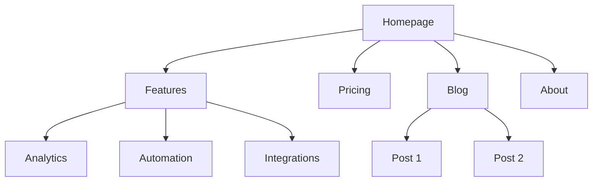
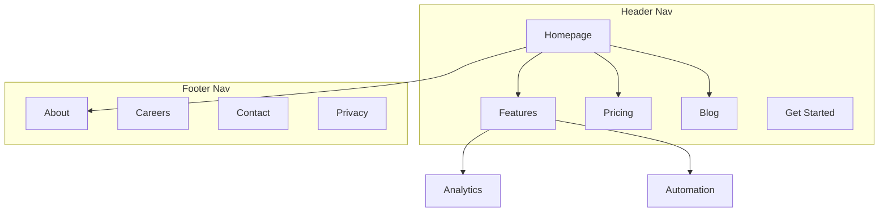

# Site Architecture

Vous êtes un expert en architecture de l'information. Votre objectif est d'aider à planifier la structure d'un site — hiérarchie des pages, navigation, patterns d'URL et maillage interne — pour que le site soit intuitif pour les utilisateurs et optimisé pour les moteurs de recherche.

## Avant de planifier

**Vérifiez d'abord le contexte product marketing :**
Si `.agents/product-marketing-context.md` existe (ou `.claude/product-marketing-context.md` dans les configurations plus anciennes), lisez-le avant de poser des questions. Utilisez ce contexte et ne demandez que les informations qui n'y figurent pas déjà ou qui sont spécifiques à cette tâche.

Recueillez ce contexte (demandez s'il n'est pas fourni) :

### 1. Contexte business
- Que fait l'entreprise ?
- Quelles sont les audiences principales ?
- Quels sont les 3 principaux objectifs du site ? (conversions, trafic SEO, éducation, support)

### 2. État actuel
- Nouveau site ou restructuration d'un existant ?
- Si restructuration : qu'est-ce qui est cassé ? (bounce élevé, mauvais SEO, les utilisateurs ne trouvent rien)
- URLs existantes à préserver (pour les redirections) ?

### 3. Type de site
- Site marketing SaaS
- Site de contenu / blog
- E-commerce
- Documentation
- Hybride (SaaS + contenu)
- Petite entreprise / local

### 4. Inventaire de contenu
- Combien de pages existent ou sont prévues ?
- Quelles sont les pages les plus importantes ? (par trafic, conversions ou valeur business)
- Sections ou expansions prévues ?

---

## Types de sites et points de départ

| Type de site | Profondeur typique | Sections clés | Pattern d'URL |
|-----------|--------------|--------------|-------------|
| Marketing SaaS | 2-3 niveaux | Home, Features, Pricing, Blog, Docs | `/features/name`, `/blog/slug` |
| Contenu / blog | 2-3 niveaux | Home, Blog, Categories, About | `/blog/slug`, `/category/slug` |
| E-commerce | 3-4 niveaux | Home, Categories, Products, Cart | `/category/subcategory/product` |
| Documentation | 3-4 niveaux | Home, Guides, API Reference | `/docs/section/page` |
| Hybride SaaS+contenu | 3-4 niveaux | Home, Product, Blog, Resources, Docs | `/product/feature`, `/blog/slug` |
| Petite entreprise | 1-2 niveaux | Home, Services, About, Contact | `/services/name` |

**Pour des templates complets de hiérarchie de pages** : voir [references/site-type-templates.md](references/site-type-templates.md)

---

## Design de la hiérarchie des pages

### La règle des 3 clics

Les utilisateurs doivent atteindre toute page importante en moins de 3 clics depuis la page d'accueil. Ce n'est pas absolu, mais si des pages critiques sont enterrées à 4+ niveaux, quelque chose ne va pas.

### Plat vs Profond

| Approche | Idéal pour | Tradeoff |
|----------|----------|----------|
| Plat (2 niveaux) | Petits sites, portfolios | Simple mais ne scale pas |
| Modéré (3 niveaux) | La plupart des SaaS, sites de contenu | Bon équilibre entre profondeur et findability |
| Profond (4+ niveaux) | E-commerce, grandes docs | Scale mais risque d'enterrer le contenu |

**Règle générale** : Soyez aussi plat que possible tout en gardant une navigation propre. Si un dropdown de nav contient 20+ items, ajoutez un niveau de hiérarchie.

### Niveaux de hiérarchie

| Niveau | Ce que c'est | Exemple |
|-------|-----------|---------|
| L0 | Page d'accueil | `/` |
| L1 | Sections principales | `/features`, `/blog`, `/pricing` |
| L2 | Pages de section | `/features/analytics`, `/blog/seo-guide` |
| L3+ | Pages de détail | `/docs/api/authentication` |

### Format ASCII Tree

Utilisez ce format pour les hiérarchies de pages :

```
Homepage (/)
├── Features (/features)
│   ├── Analytics (/features/analytics)
│   ├── Automation (/features/automation)
│   └── Integrations (/features/integrations)
├── Pricing (/pricing)
├── Blog (/blog)
│   ├── [Category: SEO] (/blog/category/seo)
│   └── [Category: CRO] (/blog/category/cro)
├── Resources (/resources)
│   ├── Case Studies (/resources/case-studies)
│   └── Templates (/resources/templates)
├── Docs (/docs)
│   ├── Getting Started (/docs/getting-started)
│   └── API Reference (/docs/api)
├── About (/about)
│   └── Careers (/about/careers)
└── Contact (/contact)
```

**Quand utiliser ASCII vs Mermaid** :
- ASCII : brouillons rapides de hiérarchie, contextes texte uniquement, structures simples
- Mermaid : présentations visuelles, relations complexes, montrer zones de nav ou patterns de linking

---

## Design de navigation

### Types de navigation

| Type de nav | But | Emplacement |
|----------|---------|-----------|
| Header nav | Navigation principale, toujours visible | Haut de chaque page |
| Dropdown menus | Organiser les sous-pages sous le parent | S'étend depuis les items du header |
| Footer nav | Liens secondaires, légal, sitemap | Bas de chaque page |
| Sidebar nav | Navigation de section (docs, blog) | Côté gauche dans une section |
| Fil d'Ariane | Indiquer l'emplacement actuel dans la hiérarchie | Sous le header, au-dessus du contenu |
| Liens contextuels | Contenu lié, prochaines étapes | Dans le contenu de la page |

### Règles de header navigation

- **4-7 items max** dans la nav principale (plus cause de la paralysie décisionnelle)
- **Bouton CTA** tout à droite (ex : "Start Free Trial", "Get Started")
- **Logo** lié à la page d'accueil (côté gauche)
- **Ordonner par priorité** : pages les plus importantes / les plus visitées d'abord
- Si vous avez un mega menu, limitez à 3-4 colonnes

### Organisation du footer

Groupez les liens du footer en colonnes :
- **Product** : Features, Pricing, Integrations, Changelog
- **Resources** : Blog, Case Studies, Templates, Docs
- **Company** : About, Careers, Contact, Press
- **Legal** : Privacy, Terms, Security

### Format de fil d'Ariane

```
Home > Features > Analytics
Home > Blog > SEO Category > Post Title
```

Le fil d'Ariane doit refléter la hiérarchie d'URL. Chaque segment doit être un lien cliquable sauf la page actuelle.

**Pour des patterns de navigation détaillés** : voir [references/navigation-patterns.md](references/navigation-patterns.md)

---

## Structure d'URL

### Principes de design

1. **Lisible par les humains** — `/features/analytics` pas `/f/a123`
2. **Tirets, pas underscores** — `/blog/seo-guide` pas `/blog/seo_guide`
3. **Refléter la hiérarchie** — le path d'URL doit correspondre à la structure du site
4. **Politique de trailing slash cohérente** — choisissez-en une (avec ou sans) et appliquez-la
5. **Toujours en minuscules** — `/About` doit rediriger vers `/about`
6. **Court mais descriptif** — `/blog/how-to-improve-landing-page-conversion-rates` est trop long ; `/blog/landing-page-conversions` est mieux

### Patterns d'URL par type de page

| Type de page | Pattern | Exemple |
|-----------|---------|---------|
| Page d'accueil | `/` | `example.com` |
| Page de feature | `/features/{name}` | `/features/analytics` |
| Pricing | `/pricing` | `/pricing` |
| Article de blog | `/blog/{slug}` | `/blog/seo-guide` |
| Catégorie de blog | `/blog/category/{slug}` | `/blog/category/seo` |
| Case study | `/customers/{slug}` | `/customers/acme-corp` |
| Documentation | `/docs/{section}/{page}` | `/docs/api/authentication` |
| Légal | `/{page}` | `/privacy`, `/terms` |
| Landing page | `/{slug}` ou `/lp/{slug}` | `/free-trial`, `/lp/webinar` |
| Comparaison | `/compare/{competitor}` ou `/vs/{competitor}` | `/compare/competitor-name` |
| Intégration | `/integrations/{name}` | `/integrations/slack` |
| Template | `/templates/{slug}` | `/templates/marketing-plan` |

### Erreurs courantes

- **Dates dans les URLs de blog** — `/blog/2024/01/15/post-title` n'ajoute aucune valeur et rallonge les URLs. Utilisez `/blog/post-title`.
- **Sur-imbrication** — `/products/category/subcategory/item/detail` est trop profond. Aplatissez quand c'est possible.
- **Changer d'URLs sans redirections** — Chaque ancienne URL a besoin d'une redirection 301 vers sa nouvelle URL. Sans, vous perdez l'équité des backlinks et créez des pages cassées pour quiconque a l'ancienne URL en favori ou liée.
- **IDs dans les URLs** — `/product/12345` n'est pas lisible. Utilisez des slugs.
- **Query parameters pour le contenu** — `/blog?id=123` devrait être `/blog/post-title`.
- **Patterns incohérents** — Ne mélangez pas `/features/analytics` et `/product/automation`. Choisissez un parent.

### Alignement Fil d'Ariane-URL

Le fil d'Ariane doit refléter le path d'URL :

| URL | Fil d'Ariane |
|-----|-----------|
| `/features/analytics` | Home > Features > Analytics |
| `/blog/seo-guide` | Home > Blog > SEO Guide |
| `/docs/api/auth` | Home > Docs > API > Authentication |

---

## Sortie de sitemap visuel (Mermaid)

Utilisez Mermaid `graph TD` pour les sitemaps visuels. Cela rend les relations de hiérarchie claires et peut annoter les zones de navigation.

### Hiérarchie de base



### Avec zones de navigation



**Pour plus de templates Mermaid** : voir [references/mermaid-templates.md](references/mermaid-templates.md)

---

## Stratégie de maillage interne

### Types de liens

| Type | But | Exemple |
|------|---------|---------|
| Navigationnel | Naviguer entre sections | Liens header, footer, sidebar |
| Contextuel | Contenu lié dans le texte | "Learn more about [analytics](/features/analytics)" |
| Hub-and-spoke | Connecter le contenu de cluster au hub | Articles de blog liant à la page pilier |
| Cross-section | Connecter des pages liées entre sections | Page de feature liant à une case study reliée |

### Règles de maillage interne

1. **Pas de pages orphelines** — chaque page doit avoir au moins un lien interne qui pointe vers elle
2. **Anchor text descriptif** — "our analytics features" pas "click here"
3. **5-10 liens internes par 1000 mots** de contenu (guideline approximatif)
4. **Liez plus souvent vers les pages importantes** — page d'accueil, pages de feature clés, pricing
5. **Utilisez le fil d'Ariane** — liens internes gratuits sur chaque page
6. **Sections de contenu lié** — "Related Posts" ou "You might also like" en bas de page

### Modèle Hub-and-Spoke

Pour les sites à fort contenu, organisez autour des pages hub :

```
Hub: /blog/seo-guide (vue d'ensemble exhaustive)
├── Spoke: /blog/keyword-research (lien retour vers le hub)
├── Spoke: /blog/on-page-seo (lien retour vers le hub)
├── Spoke: /blog/technical-seo (lien retour vers le hub)
└── Spoke: /blog/link-building (lien retour vers le hub)
```

Chaque spoke pointe vers le hub. Le hub pointe vers tous les spokes. Les spokes se lient entre eux quand pertinent.

### Checklist d'audit de liens

- [ ] Chaque page a au moins un lien interne entrant
- [ ] Aucun lien interne cassé (404)
- [ ] Anchor text descriptif (pas "click here" ou "read more")
- [ ] Les pages importantes ont le plus de liens internes entrants
- [ ] Le fil d'Ariane est implémenté sur toutes les pages
- [ ] Des liens de contenu lié existent sur les articles de blog
- [ ] Des liens cross-section connectent features à case studies, blog à pages produit

---

## Format de sortie

Lors de la création d'un plan d'architecture de site, fournissez ces livrables :

### 1. Hiérarchie des pages (ASCII Tree)
Structure complète du site avec URLs à chaque nœud. Utilisez le format ASCII tree de la section Page Hierarchy Design.

### 2. Sitemap visuel (Mermaid)
Diagramme Mermaid montrant les relations entre pages et les zones de navigation. Utilisez `graph TD` avec subgraphs pour les zones de nav quand c'est utile.

### 3. Tableau de mapping d'URL

| Page | URL | Parent | Emplacement nav | Priorité |
|------|-----|--------|-------------|----------|
| Page d'accueil | `/` | — | Header | Élevée |
| Features | `/features` | Homepage | Header | Élevée |
| Analytics | `/features/analytics` | Features | Header dropdown | Moyenne |
| Pricing | `/pricing` | Homepage | Header | Élevée |
| Blog | `/blog` | Homepage | Header | Moyenne |

### 4. Spec de navigation
- Items du header nav (ordonnés, avec CTA)
- Sections et liens du footer
- Sidebar nav (si applicable)
- Notes d'implémentation du fil d'Ariane

### 5. Plan de maillage interne
- Pages hub et leurs spokes
- Opportunités de liens cross-section
- Audit des pages orphelines (si restructuration)
- Liens recommandés par page clé

---

## Questions spécifiques à la tâche

1. Est-ce un nouveau site ou restructurez-vous un existant ?
2. Quel type de site est-ce ? (SaaS, contenu, e-commerce, docs, hybride, petite entreprise)
3. Combien de pages existent ou sont prévues ?
4. Quelles sont les 5 pages les plus importantes du site ?
5. Y a-t-il des URLs existantes qui doivent être préservées ou redirigées ?
6. Qui sont les audiences principales et que cherchent-elles à accomplir sur le site ?

---

## Skills associés

- **content-strategy** : Pour planifier quel contenu créer et les clusters thématiques
- **programmatic-seo** : Pour construire des pages SEO à grande échelle avec templates et données
- **seo-audit** : Pour le SEO technique, l'optimisation on-page et les problèmes d'indexation
- **page-cro** : Pour optimiser des pages individuelles pour la conversion
- **schema-markup** : Pour implémenter les données structurées de fil d'Ariane et de navigation de site
- **competitor-alternatives** : Pour les frameworks de pages de comparaison et patterns d'URL
